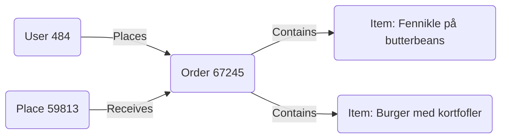

# Data Scenario Example

This document illustrates how the various CSV data files relate to each other through a specific real-world scenario.

**Scenario**: A customer places a takeaway order at a vegan restaurant.

## 1. The Place (`dim_places.csv`)
**"Green Love"** (ID: `59813`)
A vegan eatery in Frederiksberg, Denmark.
- **Location**: Godthåbsvej 142, 2000 Frederiksberg
- **Description**: "Green Love er et plantebaseret vegansk spisested..."
- **Currency**: DKK
- **Timezone**: Europe/Copenhagen

## 2. The User (`dim_users.csv`)
**Customer** (ID: `484`)
- **Name**: user 484 first_name user 484 last_name
- **Email**: user_484@example.com
- **Phone**: +45484...
- **Language**: da (Danish)
- **Roles**: authenticated, customer

## 3. The Order (`fct_orders.csv`)
**Order #67245**
- **Date**: June 8, 2021 (timestamp: `1623160965`)
- **Total Amount**: 340.00 DKK
- **Status**: Cancelled (in this specific historical record)
- **Type**: Takeaway
- **Payment Method**: Card (assumed from context)
- **Channel**: App

## 4. The Order Items (`fct_order_items.csv`)
The customer ordered two distinct items in this order.

**Item 1** (ID: `67243`)
- **Product**: "Fennikle på butterbeans"
- **Item ID**: `67194`
- **Quantity**: 1
- **Price**: 175.00 DKK
- **VAT**: 35.00 DKK (included)

**Item 2** (ID: `67244`)
- **Product**: "Burger med kortfofler"
- **Item ID**: `67195`
- **Quantity**: 1
- **Price**: 165.00 DKK
- **VAT**: 33.00 DKK (included)

## Data Flow Summary

1.  **User `484`** logs into the App.
2.  Browses **Place `59813`** ("Green Love").
3.  Selects **Item `67194`** and **Item `67195`**.
4.  Creates **Order `67245`**.
5.  System records **OrderItems `67243`** and **`67244`** linking back to the Order and the original Items.

