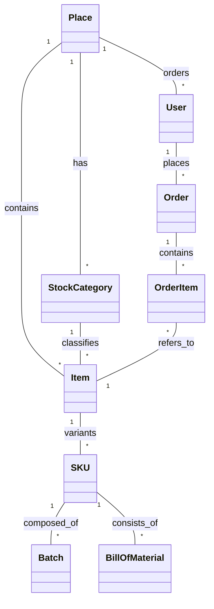

# Normalized Models Overview

This document outlines the core data models of the "Smart Inventory System", as defined in the Django codebase. These models represent the normalized schema used by the application, optimized for transactional integrity (OLTP).

## Core Application (`apps.core`)

The foundation of the system, handling users and tenancy.

- **`User`** (`AbstractUser`):
    - **Purpose**: Represents all system users (admins, staff, customers).
    - **Key Fields**: `email` (primary identifier), `mobile_phone`, `country`, `currency`, `roles` (JSON list).
    - **Normalization**: Centralizes authentication and profile data.

- **`Place`**:
    - **Purpose**: Represents a specific location, store, or warehouse (Tenant).
    - **Key Fields**: `title`, `country`, `currency`, `timezone`, `opening_hours`, `contact_email`.
    - **Normalization**: Serves as the root entity for multi-tenancy. Most other models identify a `Place`.

## Inventory Application (`apps.inventory`)

Manages stock, products, and their relationships.

- **`StockCategory`**:
    - **Purpose**: Logical grouping for inventory items.
    - **Relationships**: Belongs to a `Place`.

- **`Item`**:
    - **Purpose**: The sellable product or service.
    - **Key Fields**: `title`, `description`, `price`, `is_active`.
    - **Relationships**: Belongs to a `Place` and `StockCategory`. Has Many-to-Many with `AddOnCategory`.

- **`SKU`** (Stock Keeping Unit):
    - **Purpose**: The trackable inventory unit. Separates the "concept" of an item from its physical stock.
    - **Key Fields**: `quantity` (current stock), `unit` (kg, pcs), `low_stock_threshold`.
    - **Relationships**: Links to an `Item`.

- **`Batch`**:
    - **Purpose**: Manages expiration and received dates for specific lots of SKUs (FIFO/FEFO support).
    - **Key Fields**: `quantity`, `expiration_date`, `received_date`.
    - **Relationships**: Belongs to a `SKU`.

- **`BillOfMaterial`** (BOM):
    - **Purpose**: Defines recipes or compositions.
    - **Key Fields**: `quantity` (amount needed).
    - **Relationships**: Links a `parent_sku` to a `child_sku` (recursive relationship).

- **`AddOn`** & **`AddOnCategory`**:
    - **Purpose**: Manages modifiers (e.g., toppings, variations).
    - **Relationships**: `AddOn` belongs to an `AddOnCategory`. Items link to categories, not individual add-ons directly, for flexibility.

## Sales Application (`apps.sales`)

Handles transactions and commerce.

- **`Order`**:
    - **Purpose**: A transactional record of a sale.
    - **Key Fields**: `status`, `total_amount`, `payment_method`, `created_at`.
    - **Relationships**: Links to `Place` and `User`.

- **`OrderItem`**:
    - **Purpose**: A specific line item within an order.
    - **Key Fields**: `quantity`, `price` (snapshot at time of sale).
    - **Relationships**: Links `Order` to `Item`.

- **`Campaign`**:
    - **Purpose**: Marketing logic for discounts.
    - **Key Fields**: `discount_type`, `value`.
    - **Relationships**: Belongs to a `Place`.

## Schema Relationships Diagram (Conceptual)

